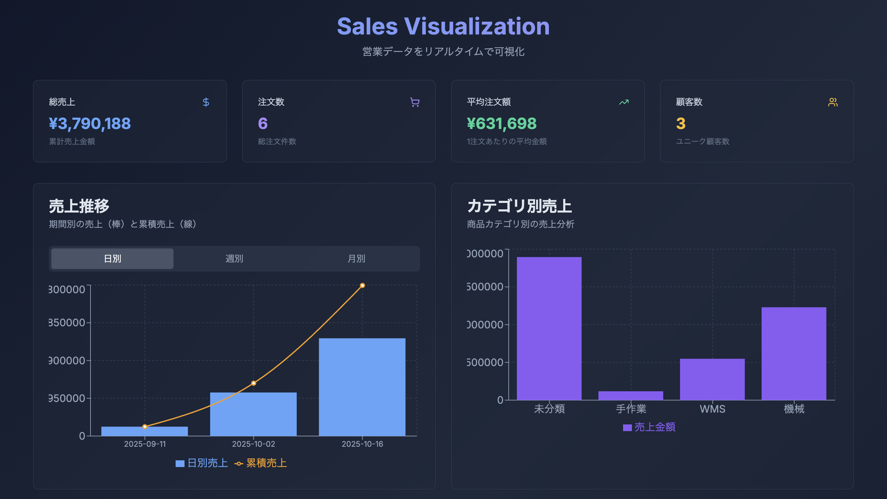

# Sales Visualization - 営業データ可視化ダッシュボード

Googleスプレッドシートに入力した営業データをリアルタイムで可視化するモダンなダッシュボードアプリケーション。

## デモ



## 特徴

- **リアルタイム同期** - Googleスプレッドシートでデータを入力すると即座にダッシュボードに反映
- **モダンなUI** - Shadcn/uiを使用したダークテーマのクールなデザイン
- **データ可視化** - Rechartsによる美しいグラフ表示（棒グラフ + 累積ライン）
- **期間選択** - 日別/週別/月別でデータを切り替え表示
- **営業担当者サマリー** - 各担当者のKPIとスパークラインチャートをカード表示
- **詳細モーダル** - 営業担当者をクリックして詳細な成績を確認
- **自動集計** - KPI（総売上、注文数、平均注文額、顧客数）を自動計算
- **レスポンシブ** - PC、タブレット、スマホに対応

## 技術スタック

### フロントエンド
- **Next.js 15** - Reactフレームワーク
- **TypeScript** - 型安全性
- **Tailwind CSS** - スタイリング
- **Shadcn/ui** - UIコンポーネント
- **Recharts** - データ可視化

### バックエンド
- **Supabase** - データベース & リアルタイム機能
- **PostgreSQL** - データストレージ

### 自動化
- **Google Apps Script (GAS)** - スプレッドシート連携

## アーキテクチャ

```
┌─────────────────────────┐
│ Google Spreadsheet      │ ← ユーザーがデータ入力
│ (営業データ)            │
└───────────┬─────────────┘
            │
            │ GAS Trigger (onEdit)
            ↓
┌─────────────────────────┐
│ Google Apps Script      │
│ (Code.gs)               │
└───────────┬─────────────┘
            │
            │ REST API (POST)
            ↓
┌─────────────────────────┐
│ Supabase                │
│ - PostgreSQL Database   │
│ - Realtime Subscription │
└───────────┬─────────────┘
            │
            │ WebSocket
            ↓
┌─────────────────────────┐
│ Next.js Dashboard       │
│ - KPI Cards             │
│ - Charts                │
│ - Data Table            │
└─────────────────────────┘
```

## セットアップ

### 1. 環境構築

```bash
# 依存関係のインストール
npm install

# 開発サーバーの起動
npm run dev
```

ブラウザで http://localhost:3000 を開く

### 2. Googleスプレッドシート連携

詳細な手順は [`gas-script/README.md`](gas-script/README.md) を参照してください。

**概要：**
1. Googleスプレッドシートを作成
2. 2つのシートを作成：
   - 「営業データ」シート - 日々の売上データ
   - 「営業担当者」シート - 営業担当者の情報
3. ヘッダー行を入力
4. Apps Scriptに `Code-Extended.gs` をコピー
5. トリガーを設定

これで、両方のシートからSupabaseへ自動同期されます。

## 使い方

### データ入力

1. Googleスプレッドシートを開く
2. 以下の形式でデータを入力：

| 日付 | 顧客名 | 商品名 | 数量 | 単価 | 合計金額 | 営業担当者 | カテゴリ | 備考 |
|------|--------|--------|------|------|----------|-----------|---------|------|
| 2025-10-26 | 株式会社ABC | ノートPC | 2 | 150000 | 300000 | 佐藤太郎 | 電子機器 | 法人向け |

3. 入力した瞬間、ダッシュボードがリアルタイムで更新されます

### ダッシュボードの見方

- **KPIカード** - 総売上、注文数、平均注文額、顧客数を表示
- **売上推移** - 日別/週別/月別で切り替え可能、棒グラフ（期間売上）+ 折れ線（累積売上）
- **カテゴリ別売上** - 商品カテゴリごとの売上を棒グラフで表示
- **営業担当者サマリー** - 各担当者のKPI（総売上、平均売上、受注件数）とスパークラインチャート
  - カードをクリックすると詳細モーダルが開きます
  - モーダルでは期間別の詳細分析、取引履歴、達成率などを確認できます
- **最新データ** - 直近10件の取引履歴をテーブル表示

## データベーススキーマ

### sales_records テーブル

| カラム名 | 型 | 制約 | 説明 |
|---------|-----|------|------|
| id | UUID | PRIMARY KEY | 自動生成ID |
| date | DATE | NOT NULL | 売上日 |
| customer_name | TEXT | NOT NULL | 顧客名 |
| product_name | TEXT | NOT NULL | 商品名 |
| quantity | INTEGER | NOT NULL, >0 | 数量 |
| unit_price | DECIMAL(10,2) | NOT NULL, >=0 | 単価 |
| total_amount | DECIMAL(10,2) | NOT NULL, >=0 | 合計金額 |
| sales_person | TEXT | NOT NULL | 営業担当者 |
| category | TEXT | NULLABLE | カテゴリ |
| notes | TEXT | NULLABLE | 備考 |
| created_at | TIMESTAMPTZ | DEFAULT now() | 作成日時 |
| updated_at | TIMESTAMPTZ | DEFAULT now() | 更新日時 |

### sales_people テーブル

| カラム名 | 型 | 制約 | 説明 |
|---------|-----|------|------|
| id | UUID | PRIMARY KEY | 自動生成ID |
| name | TEXT | UNIQUE, NOT NULL | 営業担当者名 |
| department | TEXT | NULLABLE | 部署 |
| email | TEXT | NULLABLE | メールアドレス |
| monthly_target | NUMERIC | DEFAULT 0 | 月次目標 |
| quarterly_target | NUMERIC | DEFAULT 0 | 四半期目標 |
| hire_date | DATE | NULLABLE | 入社日 |
| created_at | TIMESTAMPTZ | DEFAULT now() | 作成日時 |
| updated_at | TIMESTAMPTZ | DEFAULT now() | 更新日時 |

## プロジェクト構成

```
g-spread-visualization/
├── app/                      # Next.js App Router
│   ├── page.tsx             # メインダッシュボード
│   ├── layout.tsx           # レイアウト
│   └── globals.css          # グローバルスタイル
├── components/
│   └── ui/                  # Shadcn/ui コンポーネント
│       └── card.tsx
├── lib/
│   ├── supabase.ts          # Supabaseクライアント
│   └── utils.ts             # ユーティリティ関数
├── gas-script/              # Google Apps Script
│   ├── Code.gs              # GASスクリプト本体
│   ├── SETUP_GUIDE.md       # セットアップガイド
│   └── SPREADSHEET_TEMPLATE.md  # スプレッドシートテンプレート
├── .env.local               # 環境変数（要作成）
├── package.json
└── README.md
```

## 環境変数

`.env.local` ファイルを作成して以下を設定：

```env
NEXT_PUBLIC_SUPABASE_URL=your-supabase-url
NEXT_PUBLIC_SUPABASE_ANON_KEY=your-supabase-anon-key
```

## コマンド

```bash
# 開発サーバー起動
npm run dev

# ビルド
npm run build

# 本番サーバー起動
npm start

# Lint
npm run lint
```

## カスタマイズ

### テーマカラーの変更

`app/globals.css` の CSS変数を編集：

```css
.dark {
  --background: 222.2 84% 4.9%;  /* 背景色 */
  --foreground: 210 40% 98%;     /* 文字色 */
  --primary: 210 40% 98%;        /* プライマリカラー */
  /* ... */
}
```

### グラフの種類変更

`app/page.tsx` のRechartsコンポーネントを編集することで、グラフの種類やスタイルを変更できます。

## トラブルシューティング

### データが同期されない

1. GASスクリプトのログを確認
2. Supabase接続テストを実行
3. トリガーが正しく設定されているか確認

### ダッシュボードが表示されない

1. 開発サーバーが起動しているか確認
2. `.env.local` が正しく設定されているか確認
3. ブラウザのコンソールでエラーを確認

## ライセンス

MIT

## 作者

Created for learning purposes - MVP development practice

## 今後の拡張案

- [ ] ユーザー認証機能
- [ ] データフィルタリング機能
- [ ] CSVエクスポート機能
- [ ] より詳細な分析機能
- [ ] モバイルアプリ化
- [ ] 複数スプレッドシート対応
